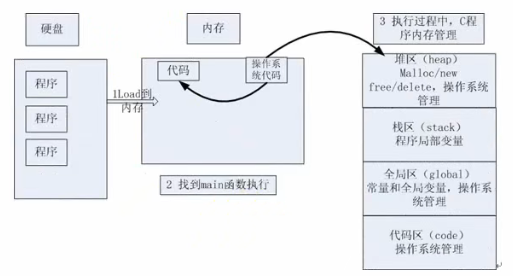

# 内存四区

## 数据类型本质分析
数据类型的概念：
+ "类型"是对数据的抽象
+ 类型相同的数据有相同的表示形式、存储格式以及相关的操作
+ 程序中使用的所有数据都必定属于某一数据类型

数据类型的分类：
+ 简单类型
  + 基本类型：整型(int)、浮点型(float/double)、字符型(char)、空类型(void)
  + 用户定义类型(typedef)
  + 枚举类型(enum) 
+ 结构类型
  + 数组(array[])
  + 结构体(struct)
  + 联合(union)
  + 类(class)
+ 指针类型(type*)

数据类型的本质：
+ 数据类型可以理解为创建变量的模具，**是固定内存大小的别名**
  + 比如4字节的内存别名是int，1字节的内存别名是char
+ 数据类型的作用：编译器预算对象(变量)分配的内存空间大小
+ 如何求数据类型的大小
  + `sizeof(dateType);`

:boom:一个~~简单的~~例子
```cpp
#include <stdio.h>
int main()
{
    int a; //告诉编译器分配4字节的内存空间
    int b[10]; //告诉编译器分配4*10字节的内存空间

    printf("sizeof(a)=%d  sizeof(b)=%d\n", sizeof(a), sizeof(b));
    /*
    1. b是数组：b和&b的大小是一样的，但是表示的数据类型是不一样的
    2. b表示的是数组的第一个元素的地址，b+1自然是数组的第二个元素的地址
    3. &b表示的是整个数组的(起始)地址，&b+1偏移的大小是数组的大小
    */
    printf("b=%d  b+1=%d  &b=%d  &b+1=%d\n", b, b+1, &b, &b+1);
    return 0;
}
```

数据类型别名：
+ 可以使用typedef关键字来给数据类型起别名
+ `typedef unsigned int u32;`

数据类型的封装：
+ 使用void*来实现数据类型的封装
+ void的字面意思是"无类型"，void*则为"无类型指针"
+ void*可以指向任何类型的数据
+ void*作为函数的参数，可以对外隐藏函数内部是如何操作内存块的

> void指针的意义：
> + C语言规定只有相同类型的指针才可以相互赋值
> + void*指针作为左值用于"接收"任意类型的指针
> + void*指针作为右值赋值给其它指针时需要强制类型转换
> + 不存在void类型的变量，C语言没有定义void究竟是多大内存的别名

## 变量本质分析
### 变量的概念
变量：变量是既能读又能写的内存对象；若一旦初始化后就不能修改的对象成为常量  
变量的定义形式：`数据类型 标识符;`  
变量的本质：
+ 程序通过变量来申请和命名内存空间：`int var = 0;`
+ 变量可以理解为一段连续内存空间的别名，是某段内存(地址)的标记
+ 修改变量有几种方式？
  + 直接修改：直接用变量名来修改
  + 间接修改：用指针来间接修改
+ 变量的三要素：名称、大小、作用域

一个引入问题  
C++编译器是如何管理函数1、函数2变量之间的关系的？  
**从内存四区模型和函数调用模型来回答**

### 内存四区
  
内存四区的建立流程：
+ 操作系统把物理硬盘代码load到内存
+ 操作系统把C代码分成四个区
+ 操作系统找到main函数入口执行

内存四区的作用：
|内存四区|作用|
|:---:|:---:|
|堆区(heap)|malloc/new/free/delete，由操作系统管理|
|栈区(stack)|程序局部变量|
|全局区(global)|常量和全局变量，由操作系统管理|
|代码区(code)|由操作系统管理|

各区元素工作分析：
|内存四区|分析|
|:---:|---|
|栈区|由编译器自动分配释放，用于存放函数的参数值，局部变量值等|
|堆区|一般由程序员分配和释放(动态内存申请和释放)，若程序员不释放，程序结束时可能由操作系统进行回收|
|全局区/静态区|全局变量和静态变量(static)的存储是放在一起的，初始化的全局变量和静态变量在一块区域，未初始化的全局变量和未初始化的静态变量在相邻的另一块区域，该区域在程序结束后由操作系统释放|
|常量区|字符串常量和其他常量的存储位置，程序结束后由操作系统释放|
|代码区|存放函数体的二进制代码|

**注意**：全局区、静态区和常量区是同一块区域  

如何使用在栈区/堆区/全局区上申请的内存：
+ main函数可以在**栈区/堆区/全局区**上分配内存，在main函数没有执行完毕时，这些分配的内存都不会被析构/释放，可以被main调用的各个函数使用
+ 函数1在栈上分配的内存会在子函数执行结束时被析构掉，如果函数2调用了函数1，那么函数2将无法使用函数1在栈区分配的内存
+ 函数1在堆区上malloc了一块内存空间，当函数1执行结束时，该内存空间不会被操作系统析构掉(堆区上的内存需要手动释放，或者main执行结束后由操作系统一起释放)，如果函数2调用了函数1，那么函数2可以使用函数1在堆区上申请的内存空间
+ 函数1在全局区分配常量"abcdef"，是可以被其他函数使用的
+ 关于字符串常量生命周期问题：https://www.jianshu.com/p/21b5b720fb75
