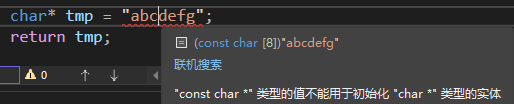

# 指针强化
## 铁律1：指针是一种数据类型
指针也是一种变量，用来保存(其他变量的)内存地址，变量就会占用内存空间

指针大小测试，在x64环境下，p与p2的大小都是8
```cpp
#include <iostream>
using namespace std;

int main()
{
    int a = 10;
    int* p = &a;
    char**** p2 = NULL;
    cout << "a = " << sizeof(a) << endl;
    cout << "p = " << sizeof(p) << endl;
    cout << "p2 = " << sizeof(p2) << endl;
    cout << "hello shin" << endl;
    return 0;
}
``` 

1. 指针*p操作内存：
   + 在指针声明的时候，"*" 号表示所声明的变量是指针
   + 在指针使用的时候，"*" 号表示操作指针所指向的内存空间的值
   + *p相当于通过地址(**p变量的值**)找到一块内存，然后操作内存
   + *p放在等号的左边是赋值(给p指向的内存赋值)
   + *p放在等号的右边是取值(从内存中取值，赋值给另一个变量)
   + *p做左值是写内存操作，做右值是读内存操作

2. 指针变量和它指向的内存块是两个不同的概念
   + 给指针变量p赋值`p = 0x1111;`只会改变指针变量的值，不会改变所指向的内存块的内容
   + 给*p赋值`*p = 0x1111;`不会改变指针变量的值，改变的是所指向的内存块的值
   + `*p = a;`表示给内存赋值变量a的值
   + `a = *p;`表示从内存取值然后赋值给变量a

3. 要保证指针指向的内存块是可以修改的
```cpp
char * getStr()
{
    char * tmp = NULL;
    tmp = "abcdefg";
    return tmp;
}

int main()
{
    char * p = getStr();
    cout << p << endl;
    *(p + 2) = 'z';
    return 0;
}
```
代码执行的结果(vs2022直接不让编译)：


4. 指针是一种数据类型，是指它指向的内存空间的数据类型
   + 指针的步长(p++)根据它所指向的内存空间的数据类型来确定
   + 指针指向谁，就把谁的地址赋值给指针
   + 不断地给指针赋值，就是不断地改变指针变量指向的内存块(和所指向的内存空间没有任何关系)

5. 避免野指针
``` cpp
#define _CRT_SECURE_NO_WARNINGS
#include <iostream>
#include <stdio.h>
using namespace std;

int main()
{
    char* p = NULL;
    // 在堆区动态申请内存
    p = (char*)malloc(100);
    if (p == NULL)
    {
        return -1; // 申请失败
    }
    // 从全局区拷贝字符串常量到动态内存
    strcpy(p, "123456abc");
    printf("point to %s", p);
    if (p != NULL)
    {
        free(p); //使用结束，释放堆区内存
    }
    // 重复释放
    if (p != NULL)
    {
        free(p);
    }
    cout << "hello shin" << endl;
    return 0;
}
```
+ 第一次使用`free(p);`释放的是堆区的内存，没有改变指针变量指向的值，此时p指向的是一块垃圾数据，成为了所谓的野指针
+ 为了避免野指针，要在释放指针指向的内存的时候，紧跟着`p = NULL;`  
+ 指针变量和它所指向的内存空间变量是两个不同的概念
+ 释放了指针所指向的内存空间，指针变量本身没有重置成NULL
+ 避免野指针：初始化指针变量的时候定义为NULL，释放指针指向的动态内存后，记得将指针变量重置为NULL
```cpp
if (p != NULL)
{
    free(p); //使用结束，释放堆区内存
    p = NULL; //防止p成为野指针
}
```


## 铁律2：间接赋值(*p)是指针存在的最大意义
1. 修改一个变量的值有两种方式：直接修改和间接修改
```cpp
int a = 10;
int *p = NULL;
p = &a;

// 直接修改
a = 20;

// 间接修改
*p = 20;
```

2. 使用指针作为函数的形参，可以间接修改形参
```cpp
#define _CRT_SECURE_NO_WARNINGS
#include <iostream>
using namespace std;

// 指针：通过形参间接修改实参
void modifyValue(int *p, int value)
{
    *p = value;
}

void modifyValue1(int b, int value)
{
    b = value;
}

int main()
{
    int a = 0;
    int* p = &a;
    modifyValue(p, 10086);
    cout << a << endl;
    modifyValue1(a, 12345);
    cout << a << endl;

    cout << "hello shin" << endl;
    return 0;
}
```
结果说明：
+ 调用modifyValue1函数并不能修改实参的值，因为在该函数中修改的只是形参b的值
+ 函数modifyValue通过形参p可以找到实参p所指向的内存地址(变量a的地址)，使用*p间接的修改了变量a的值

3. 二级指针
+ 二级指针就是指向一级指针的指针
+ 对普通变量取地址需要用一个一级指针去接收该变量的地址
+ 对指针变量取地址需要用二级指针变量来接收一级指针变量的地址
+ 以此类推，对二级指针取地址需要用一个三级指针去接收
+ 对n级指针取地址，需要用一个(n+1)级指针去接收
+ :boom: